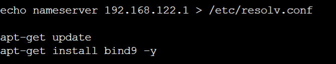
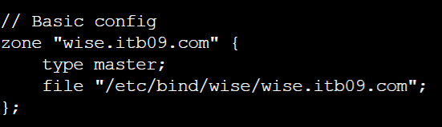
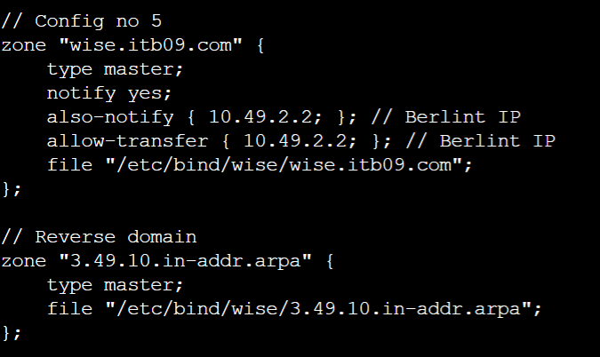

# Jarkom-Modul-2-ITB09-2022
Laporan Resmi Praktikum Jaringan Komunikasi Modul 2

---

## Anggota Kelompok
Nama | NRP
--- | ---
Rama Muhammad Murshal | 5027201041
Satrio Kamil Widhiwoso | 5027201051
Fairuz Azhar Auzan | 5027201059

## Daftar Isi
- [Soal 1](#soal-1)
- [Soal 2](#soal-2)
- [Soal 3](#soal-3)
- [Soal 4](#soal-4)
- [Soal 5](#soal-5)
- [Soal 6](#soal-6)
- [Soal 7](#soal-7)
- [Soal 8](#soal-8)

---

## Pengantar Soal
Twilight (〈黄昏 (たそがれ) 〉, <Tasogare>) adalah seorang mata-mata yang berasal dari negara Westalis. Demi menjaga perdamaian antara Westalis dengan Ostania, Twilight dengan nama samaran Loid Forger (ロイド・フォージャー, Roido Fōjā) di bawah organisasi WISE menjalankan operasinya di negara Ostania dengan cara melakukan spionase, sabotase, penyadapan dan kemungkinan pembunuhan. Berikut adalah peta dari negara Ostania:


## Soal 1
WISE akan dijadikan sebagai DNS Master, Berlint akan dijadikan DNS Slave, dan Eden akan digunakan sebagai Web Server. Terdapat 2 Client yaitu SSS, dan Garden. Semua node terhubung pada router Ostania, sehingga dapat mengakses internet.

### Jawaban Soal 1
#### a. `Ostania` sebagai Router


#### b. `WISE` sebagai DNS Master


#### c. `Berlint` sebagai DNS Slave



#### d. `Eden` sebagai Web Server


#### e. `SSS` sebagai Client


#### f. `Garden` sebagai Client


## Soal 2
Untuk mempermudah mendapatkan informasi mengenai misi dari Handler, bantulah Loid membuat website utama dengan akses wise.yyy.com dengan alias www.wise.yyy.com pada folder wise.

### Jawaban Soal 2
Pertama-tama, kita buat domain pada `/etc/bind/named.conf.local` pada `Wise`.



Kemudian, pada folder `/etc/bind` kita buat folder dengan nama `wise` yang di dalamnya kita buat lagi file `wise.itb09.com`. Selanjutnya, isi dari file tersebut adalah:


Kemudian, kita restart bind9 pada `Wise` menggunakan command `service bind9 restart`. Setelah itu, pastikan bahwa nameserver pada client `SSS` dan `Garden` mengarah pada IP `Wise`. Lalu, kita sisa testing apakah client `SSS` dan `Garden` sudah dapat terkoneksi dengan domain yang baru kita.

#### Contoh testing dari `SSS`


## Soal 3
Setelah itu ia juga ingin membuat subdomain eden.wise.yyy.com dengan alias www.eden.wise.yyy.com yang diatur DNS-nya di WISE dan mengarah ke Eden.

### Jawaban Soal 3
Pertama-tama, kita edit file `/etc/bind/wise/wise.itb09.com` menjadi seperti berikut:


Kemudian, kita restart bind9 `wise` menggunakan command `service bind9 restart`. Lalu, kita testing apakah subdomain yang barusan kita buat sudah berhasil berjalan.

#### Contoh testing dari `SSS`


## Soal 4
Buat juga reverse domain untuk domain utama.

### Jawaban Soal 4
Pada server `Wise`, kita lakukan edit pada `/etc/bind/named.conf.local` menjadi sebagai berikut:


Kemudian kita lakukan konfigurasi pada file `/etc/bind/wise/3.49.10.in-addr.arpa` menjadi sebagai berikut:


Kemudian, kita lakukan testing pada server `SSS`


## Soal 5
Agar dapat tetap dihubungi jika server WISE bermasalah, buatlah juga Berlint sebagai DNS Slave untuk domain utama.

### Pembahasan Soal 5
Pertama-tama, kita lakukan konfigurasi pada `/etc/bind/named.conf.local` pada server `Wise` menjadi sebagai berikut:



Kemudian, pada server `Wise`, kita restart server menggunakan perintah `service bind9 restart`.

Lalu, pada server `Berlint`, kita lakukan konfigurasi pada `/etc/bind/named.conf.local` menjadi sebagai berikut:


Lalu, restart server `Berlint` menggunakan `service bind9 restart`.

Selanjutnya, kita matikan service bind9 pada `Wise` menggunakan command `service bind9 stop`:


Lalu testing pada server client `SSS`:


## Soal 6
Karena banyak informasi dari Handler, buatlah subdomain yang khusus untuk operation yaitu operation.wise.yyy.com dengan alias www.operation.wise.yyy.com yang didelegasikan dari WISE ke Berlint dengan IP menuju ke Eden dalam folder operation.

### Pembahasan Soal 6
Pada server `Wise`, lakukan konfigurasi pada file `/etc/bind/wise/wise.itb09.com` menjadi sebagai berikut:


Kemudian edit file `/etc/bind/named.conf.options` dan comment `dnssec-validation auto;` dan tambahkan baris berikut:

```
allow-query{any;};  
```

Kemudian edit file `/etc/bind/named.conf.local` menjadi seperti berikut:


Pada server `Berlint`, pertama-tama kita edit file `/etc/bind/named.conf.options` dengan meng-comment `dnssec-validation auto;` dan menambahkan baris berikut:

```
allow-query{any;};
```

Kemudian edit file `/etc/bind/named.conf.local` untuk delegasi `operation`.


Kemudian lakukan konfigurasi pada file `/etc/bind/operation/operation.wise.itb09.com` sehingga menjadi seperti berikut:


Lalu, restart server `Berlint` menggunakan `service bind9 restart`.

Kemudian kita lakukan testing melalui server `SSS`


## Soal 7
Untuk informasi yang lebih spesifik mengenai Operation Strix, buatlah subdomain melalui Berlint dengan akses strix.operation.wise.yyy.com dengan alias www.strix.operation.wise.yyy.com yang mengarah ke Eden.

### Pembahasan Soal 7
Kita langsung lakukan konfigurasi pada `/etc/bind/operation/operation.wise.itb09.com` menjadi:


Kemudian kita restart server `Berlint` menggunakan command `service bind9 restart`.

Lalu, kita lakukan testing pada client `SSS`.


## Soal 8
Setelah melakukan konfigurasi server, maka dilakukan konfigurasi Webserver. Pertama dengan webserver www.wise.yyy.com. Pertama, Loid membutuhkan webserver dengan DocumentRoot pada /var/www/wise.yyy.com.

### Pembahasan Soal 8
Pertama-tama, pastikan bahwa Web Server `apache` sudah terinstall pada server `Eden`. Pastikan juga terminal browser `Lynx` sudah terinstall pada client `SSS` dan `Garden`.

Kemudian, pada server `Eden`, buat sebuah file pada `wise.itb09.com.conf` pada `/etc/apache2/sites-available`. Document root akan diletakkan pada `/var/www/wise.itb09.com`. Tak lupa pula untuk menambahkan `ServerName` dan `ServerAlias`.


